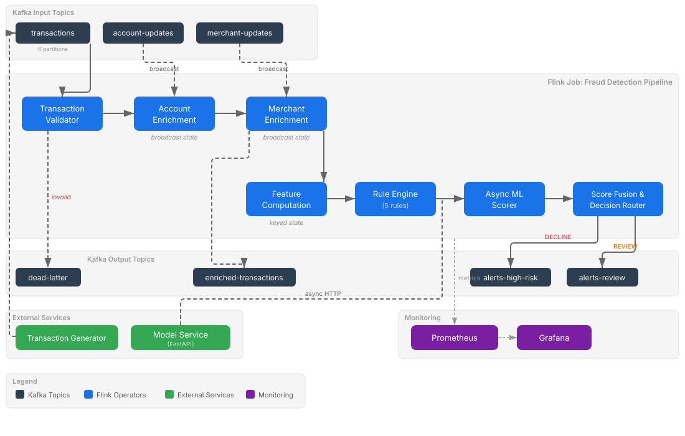

# Fraud Detection System

A real-time fraud detection pipeline built with Apache Flink 2.2 and Kafka 4.1. Transactions flow through validation, enrichment with account and merchant data via broadcast state joins, per-account feature computation, a five-rule scoring engine, async ML model scoring and weighted score fusion - producing approve, review or decline decisions in milliseconds.

## Architecture



See [docs/ARCHITECTURE.md](docs/ARCHITECTURE.md) for the full fraud detection pipeline.

## Quick Start

### Prerequisites

- Docker and Docker Compose v2
- Java 17
- Maven 3.8+
- Python 3.11+ with uv
- Make

### Run the Pipeline

```bash
# Start Kafka, Schema Registry, Flink and model service
make up && make wait-healthy

# Build the Flink job JAR
make build

# Create Kafka topics and register Avro schemas
make setup

# Deploy the pipeline to Flink
make deploy-jobs

# Start Prometheus, Grafana and kafka-exporter
make start-monitoring

# Start the transaction generator (100 TPS, 2% fraud rate)
make start-generator
```

Open http://localhost:3000 (Grafana - `admin`/`admin`) to watch transactions flow through the pipeline.

### Try the Demos

```bash
make demo-lag            # 10x traffic burst, watch consumer lag spike and recover
make demo-model-down     # Kill ML service, watch rule-only fallback
make demo-backpressure   # Throttle TaskManager CPU, observe backpressure propagation
make demo-recovery       # Kill TaskManager, watch checkpoint recovery restore state
```

See [demo/README.md](demo/README.md) for detailed walkthroughs.

## What It Demonstrates


## Fraud Detection Rules


## Project Structure

## Configuration

See [docs/CONFIGURATION.md](docs/CONFIGURATION.md) for the full reference.

## Monitoring

