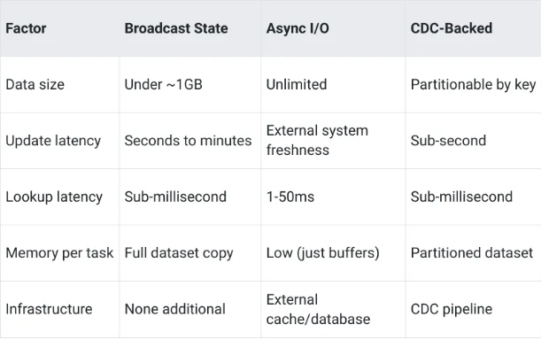

# Your Streaming Data Is Missing Context: Enrichment Patterns That Scale

Link: https://medium.com/@blakelassiter/your-streaming-data-is-missing-context-enrichment-patterns-that-scale-d5d006c7246d

## The Enrichment Problem

Consider what a raw transaction looks like:

```json
{
    "transaction_id": "tx-123",
    "account_id": "acct-456",
    "merchant_id": "merch-789",
    "amount": 5000.00,
    "timestamp": "2024-01-15T14:30:00Z"
}
```

This tells you what happened but not whether it should concern you. Now consider the same transaction with enrichment:

```json
{
    "transaction_id": "tx-123",
    "account_id": "acct-456",
    "account_age_days": 3650,
    "account_risk_score": 12,
    "typical_transaction_amount": 2500.00,
    "merchant_id": "merch-789",
    "merchant_category": "electronics",
    "merchant_risk_rating": "low",
    "merchant_country": "US",
    "amount": 5000.00,
    "amount_vs_typical": 2.0,
    "timestamp": "2024-01-15T14:30:00Z"
}
```

Now the fraud detection logic has something to work with. This is twice the typical amount but the account is ten years old with a low risk score, buying from a low-risk domestic merchant. That context changes the decision from “suspicious” to “probably fine.”

The challenge is that reference data lives in databases, not streams. Account profiles sit in a customer database. Merchant risk ratings come from a compliance system. Blacklists update through batch processes or real-time feeds. Bringing this data into the streaming pipeline creates three problems:

- **Throughput**: Querying a database for every transaction kills performance. At 10,000 transactions per second, synchronous database lookups would require 10,000 queries per second — more than most databases can handle while maintaining acceptable latency.
- **Freshness**: Reference data changes. An account’s risk score might update when suspicious activity is detected. A merchant might get added to a blacklist. Using stale data means making fraud decisions on outdated information.
- **Memory**: Loading all reference data into memory provides fast lookups but requires significant resources. A million account profiles at 1KB each needs a gigabyte of memory per parallel task instance.

## Stream-Stream Joins: Correlating Two Event Streams

Sometimes the enrichment data you need comes from another stream rather than a static table. Correlating a login stream with a transaction stream can reveal suspicious patterns — did someone log in from a new device immediately before making a large purchase?

Flink provides two approaches for stream-stream joins: windowed joins and interval joins.

- **Windowed joins** match events that fall into the same time window:

    ```java
    transactionStream
        .join(loginStream)
        .where(tx -> tx.getAccountId())
        .equalTo(login -> login.getAccountId())
        .window(TumblingEventTimeWindows.of(Time.minutes(5)))
        .apply(new TransactionLoginJoiner());
    ```
    - Windowed joins use fixed boundaries — with 5-minute tumbling windows, the boundaries are [10:00–10:05), [10:05–10:10), and so on. Events match only if they fall in the same window. This creates an awkward edge case: a login at 10:04 and a transaction at 10:06 won’t match even though they’re only two minutes apart, because they fall in different windows.
    - For fraud detection, this boundary problem makes windowed joins a poor fit. What you typically want is “find logins within X minutes before this transaction” — a relative time range, not fixed calendar boundaries.

- **Interval joins** solve this by defining a time range relative to each event:

    ```java
    transactionStream
        .keyBy(tx -> tx.getAccountId())
        .intervalJoin(loginStream.keyBy(login -> login.getAccountId()))
        .between(Time.minutes(-10), Time.minutes(0))
        .process(new TransactionLoginProcessor());
    ```
    - For each transaction, this finds login events from the previous ten minutes. A transaction at 10:15 matches logins between 10:05 and 10:15 — regardless of window boundaries. This is almost always what you want for correlating events in fraud detection.

Both approaches buffer events in state until the join window or interval passes. Memory usage scales with event rate multiplied by the time range. For an interval join looking back 10 minutes, if the login stream runs at 1,000 events per second, you’re buffering roughly 600,000 login events in state — per key partition.

## Stream-Table Joins: The Fundamental Pattern

Most enrichment involves looking up relatively static reference data. Conceptually it’s simple:

```txt
For each transaction:
    Look up account profile by account_id
    Look up merchant data by merchant_id
    Check blacklists
    Combine into enriched transaction
```

The challenge is implementation. How you perform these lookups determines whether your pipeline handles 100 events per second or 100,000.

A naive approach queries the database for each event. At low volumes this works fine. At high volumes it creates two problems: the database can’t handle the query load, and the synchronous queries add latency that slows the entire pipeline. A 10ms database query per event means 10 seconds to process 1,000 events — serial execution turns your stream processor into a batch system.

The next section covers three strategies that avoid these problems, each with different tradeoffs for data size, update frequency and latency requirements.

## Choosing an Enrichment Strategy

The right enrichment strategy depends on three factors: how large is your reference data, how often does it change and what latency can you tolerate?



### When Reference Data Fits in Memory: Broadcast State

For small, slowly-changing reference data, the simplest approach is loading everything into memory on every parallel task instance. [Flink’s broadcast state](https://nightlies.apache.org/flink/flink-docs-stable/docs/dev/datastream/fault-tolerance/broadcast_state/) does exactly this — it takes a stream of reference data and makes it available as in-memory state that all parallel instances can read.

Broadcast state works well when:
- Reference data is small enough to fit in memory (a useful rule of thumb: under 1GB)
- Data changes infrequently — daily updates rather than per-second changes
- You need sub-millisecond lookup latency

The implementation involves broadcasting reference data to all task instances and then connecting that broadcast stream with your main data stream:

```java
// Define the broadcast state descriptor
MapStateDescriptor<String, AccountProfile> profileDescriptor = 
    new MapStateDescriptor<>(
        "account-profiles",
        String.class,
        AccountProfile.class
    );

// Broadcast the account profiles to all parallel instances
BroadcastStream<AccountProfile> profileBroadcast = 
    accountProfileStream.broadcast(profileDescriptor);

// Connect transaction stream with broadcast profiles
transactionStream
    .keyBy(tx -> tx.getAccountId())
    .connect(profileBroadcast)
    .process(new AccountEnrichmentFunction());
```

The `AccountEnrichmentFunction` extends `KeyedBroadcastProcessFunction` and implements two methods - one for processing transactions (the keyed stream) and one for processing profile updates (the broadcast stream):

```java
public class AccountEnrichmentFunction 
    extends KeyedBroadcastProcessFunction<String, Transaction, AccountProfile, EnrichedTransaction> {
    
    private final MapStateDescriptor<String, AccountProfile> profileDescriptor;
    
    public AccountEnrichmentFunction(MapStateDescriptor<String, AccountProfile> descriptor) {
        this.profileDescriptor = descriptor;
    }
    
    @Override
    public void processElement(
            Transaction tx, 
            ReadOnlyContext ctx, 
            Collector<EnrichedTransaction> out) throws Exception {
        
        ReadOnlyBroadcastState<String, AccountProfile> profiles = 
            ctx.getBroadcastState(profileDescriptor);
        
        AccountProfile profile = profiles.get(tx.getAccountId());
        out.collect(enrich(tx, profile));
    }
    
    @Override
    public void processBroadcastElement(
            AccountProfile profile, 
            Context ctx, 
            Collector<EnrichedTransaction> out) throws Exception {
        
        ctx.getBroadcastState(profileDescriptor)
           .put(profile.getAccountId(), profile);
    }
}
```

The `processElement` method handles incoming transactions by looking up the account profile from broadcast state. Since broadcast state is just an in-memory hash map, lookup latency is sub-millisecond. The processBroadcastElement method handles profile updates by storing them in the broadcast state.

The tradeoff is memory. Each parallel task instance holds a complete copy of the reference data. With 10 task instances and 500MB of reference data, you’re using 5GB total memory just for broadcast state.

For fraud detection, broadcast state fits well for:
- Account profiles when account counts are manageable (millions of accounts at ~1KB each fits in ~1GB)
- Merchant blacklists which typically contain thousands of entries, not millions
- Merchant category codes which are relatively small lookup tables

One operational note: broadcast state can catch you off guard when reference data grows. We started with 50,000 merchants in our blacklist — maybe 5MB of data. Over two years it grew to 500,000 entries. So, monitor your broadcast state size and set alerts before it closes to memory limits.

### When Data is Too Large: Async I/O

### When You Need Real-Time Updates: CDC-Backed Enrichment

## Caching Strategies for Async I/O


## Practical Patterns for Fraud Detection

Bringing the strategies together, here’s how enrichment typically works in a fraud detection pipeline:
- **Account profiles** (Broadcast or CDC): Risk scores, account age, typical transaction amounts. The data is relatively small (one record per account, not one per transaction). For systems with a manageable account count, broadcast state works well. For systems where account risk scores update frequently based on recent activity, CDC-backed enrichment ensures decisions use current scores.
- **Merchant categorization** (Broadcast): Merchant category codes, risk ratings and country information. This data changes slowly — merchants don’t change categories often. Broadcast state is the obvious choice.
- **Blacklist checking** (Broadcast with frequent refresh): Known fraudulent cards, devices, accounts and merchants. The dataset is small but updates matter urgently — when fraud is discovered, you want to block it immediately. Broadcast state with a frequently-refreshed source stream, or CDC-backed if you need sub-second propagation.
- **Geographic enrichment** (Async I/O with cache): IP-to-location lookups, postal code data, distance calculations. These datasets are large but change rarely. Async I/O with aggressive caching keeps lookup latency low while handling datasets that don’t fit in memory.

A pipeline combining these patterns might look like:

```java
// Start with raw transactions
DataStream<Transaction> transactions = ...;

// Broadcast small, slowly-changing reference data
BroadcastStream<MerchantInfo> merchantBroadcast = 
    merchantStream.broadcast(merchantDescriptor);
BroadcastStream<Blacklist> blacklistBroadcast = 
    blacklistStream.broadcast(blacklistDescriptor);

// Enrich with merchant data
DataStream<Transaction> withMerchant = transactions
    .keyBy(tx -> tx.getMerchantId())
    .connect(merchantBroadcast)
    .process(new MerchantEnrichment());

// Check blacklists
DataStream<Transaction> withBlacklist = withMerchant
    .keyBy(tx -> tx.getAccountId())
    .connect(blacklistBroadcast)
    .process(new BlacklistCheck());

// Async I/O for geographic lookup (large dataset, high cache hit rate)
DataStream<EnrichedTransaction> fullyEnriched = 
    AsyncDataStream.orderedWait(
        withBlacklist,
        new AsyncGeoLookup(),
        10, TimeUnit.SECONDS,
        100
    );
```

The ordering matters. Broadcast enrichments are fast and can filter out obvious fraud (blacklisted accounts) before more expensive async lookups. Geographic enrichment — the slowest step — happens last, and only for transactions that pass earlier checks.

## Handling Enrichment Failures